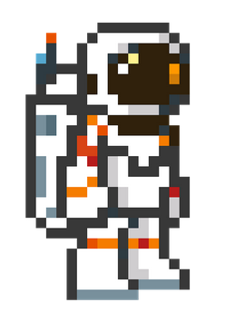
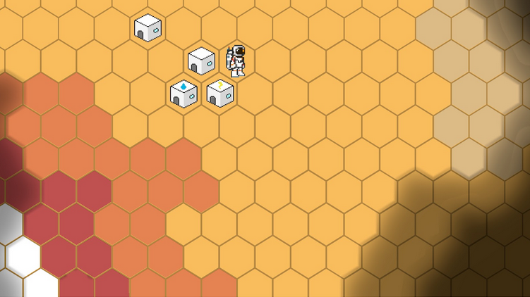
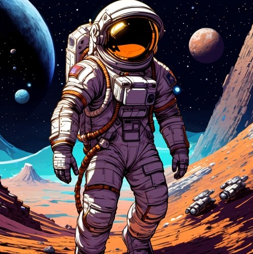

# Star Settlers

## Krótki opis fabularny:
Od upadku Federacji minęło już trochę lat, jednak wszyscy nadal pamiętają chaos jaki mu towarzyszył. Całe planety zostały odcięte od dostaw surowców, a ich mieszkańcy w panice unicestwili sami siebie, walcząc o zapasy. Mimo opanowania technologii pozwalającej na podróż w kosmos, ludzie cofnęli się do czasów, w których rządzą najsilniejsi - kolonie, które przetrwały początkową panikę, zwróciły się przeciwko swoim sąsiadom. Całe floty statków kosmicznych zostały unicestwione w desperackiej wojnie o przetrwanie.

Wojska kolonialne nie dysponowały jednak siłą, która mogłaby się równać z siłą pieniądza. Megakorporacje, prowadzące biznes w każdym zakątku dawnej Federacji, posiadały ogromne floty własnych okrętów, których dawniej używały do ochrony transportów, a w czasie kryzysu posłużyły się nimi do przejęcia kontroli w galaktyce. Teraz, kiedy kurz bitwy opadł i każda skolonizowana planeta znajduje się pod ich władaniem, megakorporacje wyciągają ręce po niezbadane systemy z pogranicza Federacji.

Gracz ma wcielić się w rolę kontraktora zatrudnionego przez jedną z megakorporacji, w celu zbadania nieznanej planety oraz ustanowienia na niej kolonii. Nie jest to jednak łatwe zadanie, bo poza otrzymaniem podstawowych surowców i narzędzi, gracz jest zdany na siebie - firma oczekuje rezultatów, a jeśli gracz nie jest w stanie ich przedstawić, to na jego miejsce można łatwo znaleźć kogoś nowego. Poza tym, to że planeta jest nie skolonizowana, nie znaczy że nikt na niej nie mieszka - po przejęciu kontroli przez megakorporacje, część ludzi niezadowolonych z ich rządów uciekło szukać nowego domu w niezbadanych fragmentach kosmosu. Zagrożeniem mogą być również ekstremalne warunki, panujące na tej dzikiej planecie, czy być może nawet obce formy życia.

# Funkcjonalności:
## Eksploracja
Gracz ma mapę na której widzi początkowo tylko swoją bazę i tereny wokół niej. Musi odkrywać nieznany mu świat.
Dystans jaki gracz może pokonać zależy od posiadanych przez niego zasobów, początkowo tlen w kombinezonie szybko się kończy dlatego też możliwy do pokonania dystans jest niewielki. Z czasem gracz może używać urządzeń takich jak łazik by zwiększyć ten dystans i odkryć nowe rejony mapy. 
Budowa
Gracz może konstruować różnego rodzaju budowle w zasięgu bazy. Budowle te mogą zwiększać produkcję zasobów w kolejnych turach, tworzyć ochronę przed przeciwnikami lub złymi wydarzeniami, obniżać zużycie tlenu na wyprawach lub być wymagane w celu dalszej progresji fabularnej.
Budowle wymagają surowców, np. stali, prądu i wody, które możemy odnajdywać poprzez eksplorację lub produkować w pozostałych budynkach. Stworzenie budowli zajmuje także określony czas (przykładowo, można zbudować jedną rzecz na turę).
W oddalonych regionach mapy, gracz będzie mógł znaleźć “opuszczone obozowiska”, które następnie będzie mógł naprawić i rozpoczynać kolejny dzień w ich miejscu, zamiast powracać do głównej bazy. Da mu to także kolejny teren do rozbudowy.
## Baza
W bazie gracz może przeprowadzać badania, na zebranych podczas eksploracji próbkach, handlować surowcami i decydować jaki sprzęt chce ze sobą zabrać na następną wyprawę. 
Badania mogą przynosić zyski oraz odblokowywać nowe konstrukcje lub przedmioty. 
Poprzez handel gracz może wymieniać dane o planecie na walutę za którą może kupować wyjątkowy ekwipunek. Może również wymieniać nadmiarowe surowce na inne po zawyżonej cenie.
Wybór ekwipunku wpływa na opcje interakcji z otoczeniem, jakie gracz będzie miał dostępne podczas wyprawy.
## Ekwipunek
Podczas eksploracji przydatne będą narzędzia takie jak zestaw do pobierania próbek ziemi czy radar do poszukiwania części rozbitych zrzutów z zasobami.
Miejsce w ekwipunku jest jednak ograniczone. Co sprawia że każda ekspedycja wymaga planowania i ustalenia jej celu. Po powrocie z podróży zdobyte zasoby można bezpiecznie przechować w bazie, zbadać, lub wykorzystać w budowie.
(Opcjonalne) Różnego rodzaju bronie. Dystansowa, biała itp.
## Interakcje z NPC
Prowadzenie pokojowych rozmów.
Podejmowanie walki z przeciwnikami.
Nie każdy przeciwnik będzie możliwy do pokonania pokojowo, oraz nie każdego będzie można pokonać siłowo. Obie opcje mogą zakończyć się stratami jak i zyskami.
(Opcjonalne) Gracz może otrzymać też proste zadania poboczne od napotkanych NPC, których wykonanie będzie wiązało się z nowym przedmiotem, walutą lub surowcami.
(Opcjonalne) Frakcje przeciwników, gdzie możemy zaprzyjaźnić się z daną frakcją przez co nie będziemy mieli problemów się z nimi dogadać.
(Opcjonalne) Rekrutowanie NPC do drużyny eksploracyjnej.
## Świat
Losowo generowana mapa
Mapa podzielona na siatkę
Podział świata na parę regionów, różniących się klimatem i rzeczami jakie możemy tam napotkać.
Każdy region będzie posiadał część potrzebną do zakończenia rozgrywki.
(Opcjonalne) Modyfikatory terenu, pogoda i inne rzeczy wpływające losowo na kolejne tury
## Bohater
Bohater jest śmiertelny.
Na starcie można wybrać pod jaką korporację podlega nasza postać, co daje graczowi różne modyfikatory na całą grę.
Bohater będzie posiadał statystyki (np. siła, charyzma, szybkość) oraz poziom. 
Rozwój postaci w formie perków, które zdobywamy poprzez badania a dodają unikalne zdolności oraz statystyki zdobywane wraz z punktami milowymi eksploracji.

	

## Decyzje Techniczne:

Zdecydowaliśmy się na użycie silnika Godot lub Unity, dokładną decyzję podejmiemy po dokładnym zapoznaniu się z tymi technologiami.
Przedstawimy świat za pomocą siatki heksagonalnej ze względu na jej bardziej futurystyczny wygląd i większą swobodę ruchu. Chcemy by mnogość wyborów i możliwości eksploracji były wyczuwalne w każdym aspekcie gry.

## Decyzje artystyczne:

Chcemy by motyw wyboru korporacji i pewnej rywalizacji o podbój kosmosu przywodził na myśl zimną wojnę i pierwsze wyprawy człowieka w kosmos. By ułatwić graczom tą podróż w czasie decydujemy się na pixelowa oprawa graficzna oraz 8-bitową muzykę które współgrają z motywem gry.

## Przykładowy model postaci gracza:

## Przykładowy wygląd mapy:

## Inspiracje:
+ Marsjanin
+ Terraformacja Marsa
+ Heroes

